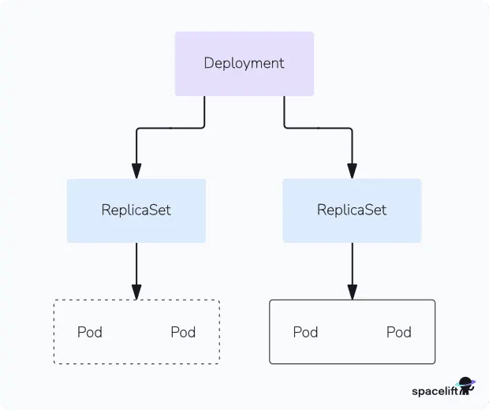

# Deploy Applications with Kubernetes Deployments

## Question

The Nautilus DevOps team is delving into Kubernetes for app management. One team member needs to create a deployment following these details:

Create a deployment named nginx to deploy the application nginx using the image nginx:latest (ensure to specify the tag)

Note: The kubectl utility on jump_host is set up to interact with the Kubernetes cluster.

## Answer

- Create file called `deployment.yml`

```yml
apiVersion: apps/v1
kind: Deployment
metadata:
  name: nginx
spec:
  replicas: 1
  selector:
    matchLabels:
      app: nginx
  template:
    metadata:
      labels:
        app: nginx
    spec:
      containers:
        - name: nginx
          image: nginx:latest
```

- run the deployment

```bash
kubectl apply -f deployment.yml
```

## Additional Details

Additional commands with `deployment`

Get the created `deployment`s list

```bash
kubectl get deployments
```

## Brief Description About the Environment

**What is deployment?**



A Kubernetes Deployment is a high-level resource object that provides a declarative way to manage the deployment, scaling, and lifecycle of a set of identical Pods. It ensures that a specified number of Pod replicas are running and healthy at all times, automatically replacing any failed Pods to maintain the desired state. Deployments are typically used for stateless applications and offer features like rolling updates to introduce new versions without downtime, and easy rollbacks if an update causes issues. They achieve this by managing ReplicaSets, which in turn create and manage the actual Pods based on the Deployment's defined template.


